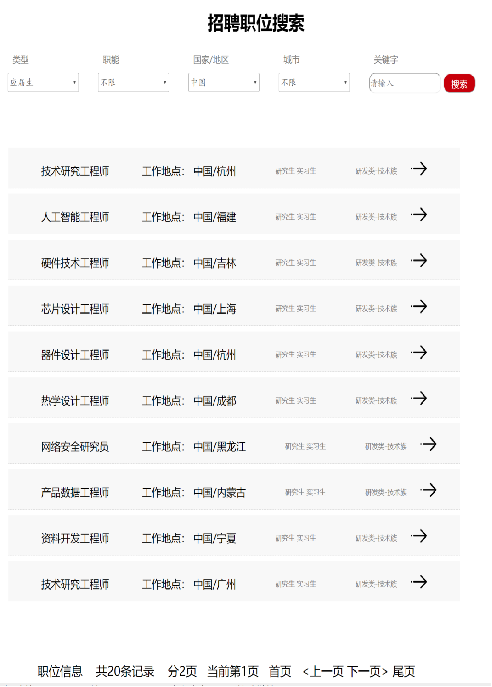

# web前端开发技术-企业宣传网站

## 前言

【百度网盘】 中居然还保存着大二《Web前端开发技术》的大作业代码，泪目了/(ㄒoㄒ)/~~

## 页面介绍

这个项目做的内容是企业宣传网站，只有前端部分。用的是前端3件套实现滴。

共5个模块：

1. 首页（企业简介）

2. 校园招聘

3. 新闻公告

   

4. 联系我们

5. 注册

## 技术点

- 导航栏
  - 导航栏中简单的描述了网站的基本组成。并且**通过css3中-webkit-transition-delay属性延迟过渡时间**。从而**实现了产品的菜单的旋转**。
- 首页中的公司信息
  - 进行公司信息设计时，做了一些效果。**当鼠标放在图片上时，图片会向左移动**。使得网页更具有动态效果。
- 首页中的公司简介
  - 当依次滑动鼠标向下观看时，是以图片框滚动的形式展现。在这里，我**使用了动画驱动库中的aos**实现此效果。依次向观看对象完整的介绍公司。
- 校园招聘
  - 网页的前边部分**以轮播图的形式**展现了一些招聘相关的图片。
  - 对于不同类型的求职者设置展现相对应的岗位，有需求者可以通过下面的下拉列表寻找相应适合自己的内容。并将这些岗位具体信息**以分页的形式展现**。

- 注册界面
  - 以**悬浮窗口**的形式展现。

## 开发环境

- 前端3件套 html,css,javascript
- IDEA

## Last

本着开源的精神分享出来，写的比较烂，全是自己码的，好在能用，轻喷 QWQ

仓库中提供了PPT以及文档还有录制的实时视频，可以更好的观看~

喜欢的留下小星星吧🤞🤞🤞

